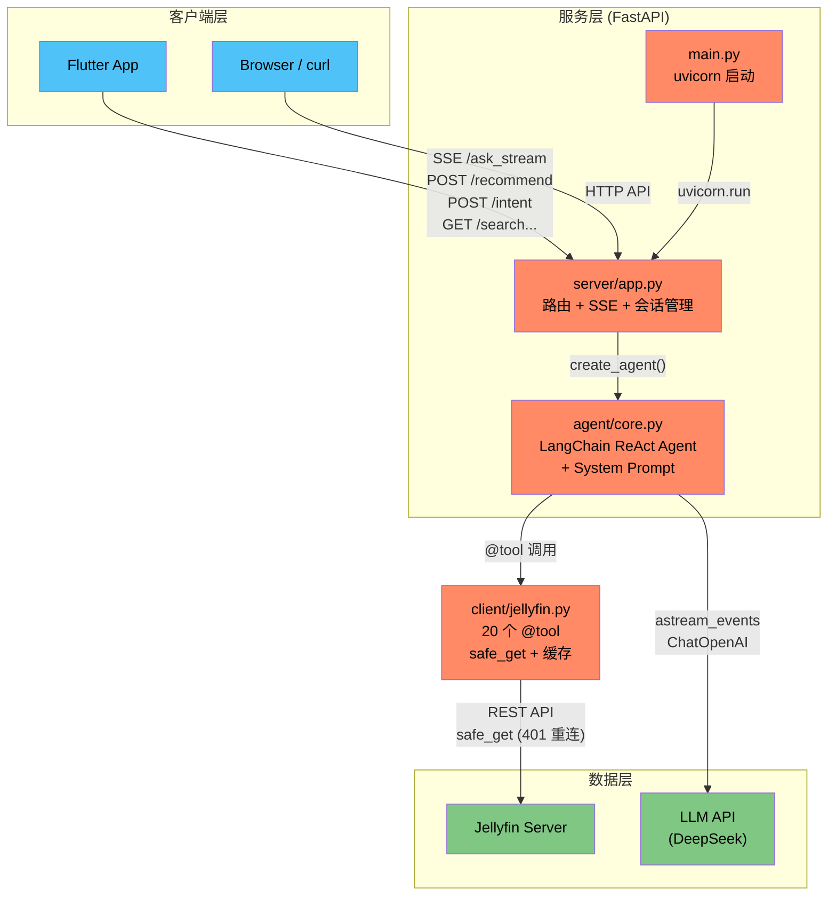
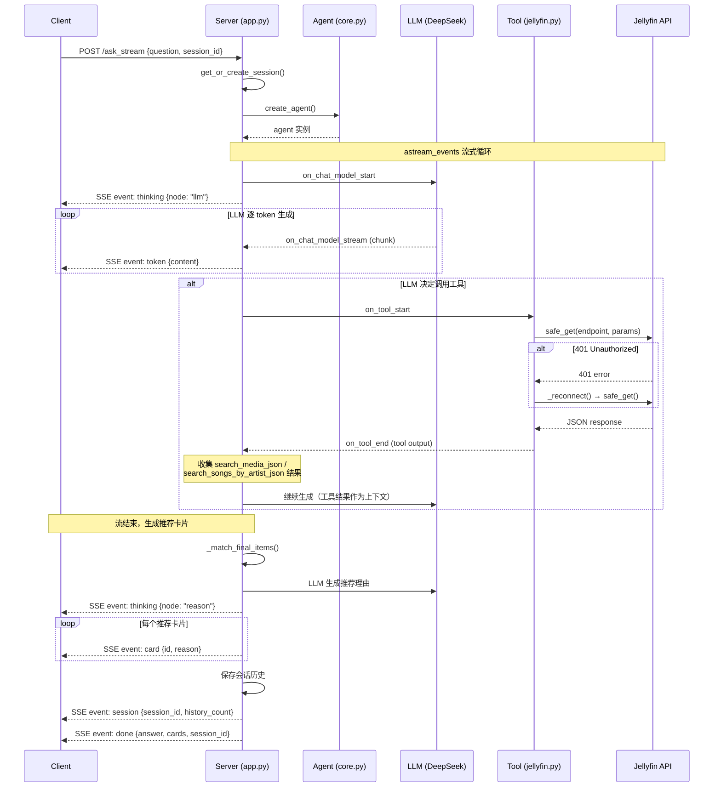
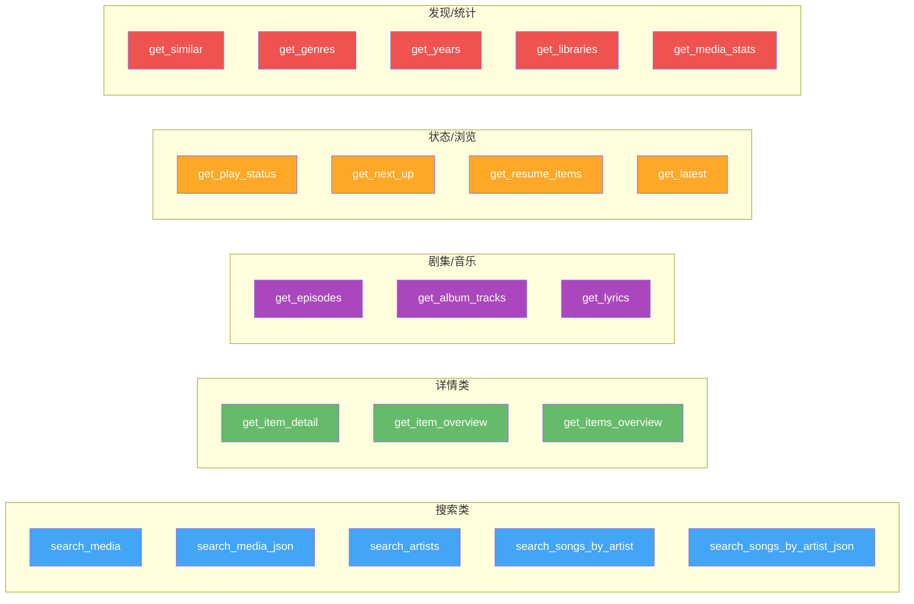

# 系统架构图

本文档包含 3 张 Mermaid 图，帮助开发者快速理解系统结构、数据流和工具分类。

---

## 图 1：系统架构图

### 四种交互模式

| 模式 | 端点 | 说明 |
|------|------|------|
| **SSE** | `/ask_stream` | ReAct Agent 流式对话，逐 token 推送 |
| **Recommend** | `/recommend` | LLM 提取参数 → 搜索 → 生成推荐理由 |
| **Intent** | `/intent` | LLM 意图分析 → 直接调工具 → 返回结果 |
| **Direct API** | `/search`, `/detail`, `/episodes` ... | 直接调工具，不走 LLM |

---

## 图 2：SSE 流程图

---

## 图 3：工具分类图

共 20 个 `@tool`，分为 5 个功能类别：

- **搜索类** (蓝色) — 按关键字/歌手搜索媒体，含 JSON 变体供前端卡片渲染
- **详情类** (绿色) — 获取单个或批量条目的完整元数据/简介
- **剧集/音乐** (紫色) — 查询剧集列表、专辑曲目、歌词
- **状态/浏览** (橙色) — 播放状态、追剧下一集、继续播放、最新内容
- **发现/统计** (红色) — 相似推荐、风格/年份/媒体库列表、数量统计
